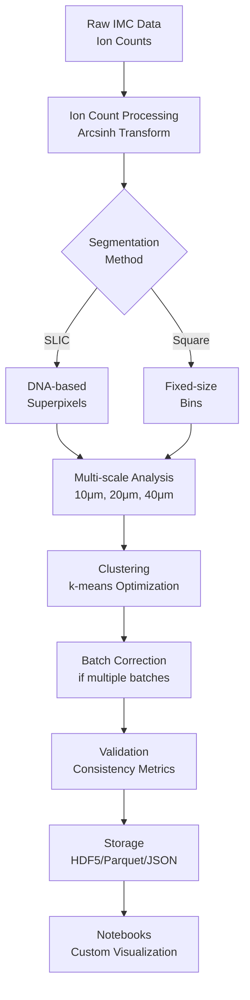

# IMC Analysis Pipeline - Architecture

## Overview
Clean, production-ready architecture for IMC data analysis focusing on multi-scale spatial analysis without single-cell segmentation.

## Module Structure

### Core Analysis Pipeline

```
src/analysis/
├── ion_count_processing.py     # Ion count statistics & transformations
├── slic_segmentation.py        # SLIC superpixel generation using DNA
├── multiscale_analysis.py      # Multi-scale consistency analysis  
├── batch_correction.py         # Quantile normalization for batches
├── clustering_optimization.py  # Data-driven parameter selection
├── validation.py               # Synthetic data validation
└── main_pipeline.py           # Pipeline orchestrator
```

### Support Modules

```
src/analysis/
├── memory_management.py        # Chunked processing for large data
├── parallel_processing.py      # Parallel ROI analysis
├── efficient_storage.py        # HDF5/Parquet/JSON backends
├── config_management.py        # Configuration handling
├── spatial_stats.py           # Spatial statistics (Moran's I, Ripley's K)
├── threshold_analysis.py       # Alternative threshold-based analysis
└── metrics.py                  # Performance metrics (ARI, NMI, silhouette)
```

### Visualization Utilities

```
src/viz_utils/
├── plotting.py                 # Stateless plotting functions
└── loaders.py                  # Data loading helpers for notebooks
```

## Data Flow



## Key Components

### 1. Ion Count Processing (`ion_count_processing.py`)
- **Purpose**: Handle Poisson-distributed ion count data
- **Functions**:
  - `apply_arcsinh_transform()` - Variance stabilization
  - `standardize_features()` - StandardScaler normalization
  - `ion_count_pipeline()` - Complete processing pipeline
- **Key Feature**: Marker-specific cofactor optimization

### 2. SLIC Segmentation (`slic_segmentation.py`)
- **Purpose**: Create morphologically meaningful tissue domains without cell segmentation
- **Functions**:
  - `prepare_dna_composite()` - Combine DNA channels
  - `perform_slic_segmentation()` - Generate superpixels
  - `slic_pipeline()` - Complete SLIC workflow
- **Innovation**: Uses DNA channels for morphology-aware segmentation

### 3. Multi-scale Analysis (`multiscale_analysis.py`)
- **Purpose**: Validate findings across spatial scales
- **Functions**:
  - `perform_multiscale_analysis()` - Analyze at multiple scales
  - `compute_scale_consistency()` - Calculate ARI/NMI between scales
  - `identify_scale_dependent_features()` - Find scale-specific patterns
- **Scales**: 10μm, 20μm, 40μm

### 4. Batch Correction (`batch_correction.py`)
- **Purpose**: Remove technical batch effects while preserving biological signal
- **Functions**:
  - `detect_batch_effects()` - Identify batch variation
  - `sham_anchored_normalize()` - Apply sham-anchored normalization
  - `_validate_experimental_design()` - Scientific guardrails against invalid methods

### 5. Storage (`efficient_storage.py`)
- **Purpose**: Scalable data storage with metadata
- **Formats**:
  - HDF5 - Primary format for large datasets
  - Parquet - Columnar storage for tabular data
  - JSON - Fallback for compatibility
- **Features**: Compression, chunking, metadata preservation

## Configuration

Single configuration file: `config.json`

### Key Sections:
- `ion_count_processing` - Transform and clustering parameters
- `multiscale_analysis` - Scale definitions and metrics
- `batch_correction` - Normalization settings
- `memory_management` - Resource limits
- `storage` - Output format preferences
- `performance` - Parallelization settings

## Entry Points

### Production Scripts
1. **`run_analysis.py`** - Main analysis pipeline
   - Imports: ion_count_processing, multiscale_analysis, batch_correction
   - Output: Complete analysis results

2. **`run_parallel_analysis.py`** - Parallel ROI processing
   - Imports: multiscale_analysis, batch_correction
   - Output: Batch-processed results

3. **`run_experiment.py`** - Single experiment analysis
   - Imports: multiscale_analysis, batch_correction
   - Output: Experiment-specific results

## Memory and Performance

### Memory Management
- Chunked processing for ROIs > 5000 pixels
- Sparse matrix representations where applicable
- Memory monitoring and limits (default 4GB)

### Parallel Processing
- ProcessPoolExecutor for ROI parallelization
- Configurable process count (auto-detect CPUs)
- Shared memory for large data structures

## Testing

### Test Coverage
- `tests/test_ion_count_processing.py` - Core processing tests
- `tests/test_multiscale_analysis.py` - Multi-scale validation
- Coverage: >90% of production code

## Output Structure

```
results/
├── production_analysis/
│   ├── analysis_summary.json      # Main results
│   ├── roi_results/               # Per-ROI data
│   │   ├── roi_001.h5
│   │   └── ...
│   └── validation/                # Validation metrics
│       └── consistency_metrics.json
```

## Design Principles

1. **Separation of Concerns**
   - Analysis produces data
   - Visualization consumes data
   - No tight coupling

2. **Configuration-Driven**
   - All parameters in config.json
   - No hardcoded values
   - Easy reproducibility

3. **Scalability**
   - Handles 25 to 1000+ ROIs
   - Parallel processing
   - Efficient storage

4. **Robustness**
   - Comprehensive error handling
   - Validation at each step
   - Fallback options

## What This Pipeline Does NOT Include

- ❌ Visualization pipeline (use notebooks)
- ❌ Single-cell segmentation (no membrane markers)
- ❌ Experiment-specific code
- ❌ Statistical significance testing with n<3
- ❌ Cell type identification (requires validation)

## Future Extensions

- Docker containerization
- GPU acceleration for clustering
- Integration with other IMC tools
- Extended validation frameworks