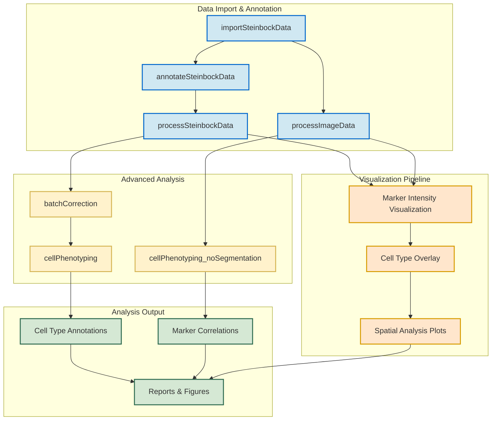

# Steinbock IMC Data Analysis Pipeline

This repository contains an R-based analysis pipeline for Imaging Mass Cytometry (IMC) data, specifically designed to work with outputs from the [Steinbock](https://github.com/BodenmillerGroup/steinbock) preprocessing pipeline. The workflow encompasses data import, annotation, processing, visualization, and advanced analysis of IMC data.

## Pipeline Overview




## Pipeline Components

### Data Import & Annotation

1. **importSteinbockData.R**
   - Imports processed single-cell data from the Steinbock pipeline
   - Loads multi-channel images and segmentation masks
   - Outputs SpatialExperiment object (spe), images, and masks objects

2. **annotateSteinbockData.R**
   - Loads the previously imported SpatialExperiment object
   - Assigns unique cell identifiers
   - Merges external metadata using configuration-driven file paths

3. **processSteinbockData.R**
   - Applies transformations to count data (asinh transformation)
   - Conducts quality control filtering based on cell area
   - Flags channels for downstream analysis
   - Runs dimensionality reduction (PCA, UMAP, t-SNE)

4. **processImageData.R**
   - Loads and processes multi-channel images and segmentation masks
   - Sets channel names from the SpatialExperiment object
   - Attaches masks to images and performs quality control checks

### Advanced Analysis

5. **batchCorrection.R**
   - Performs batch correction using fastMNN method
   - Integrates low-dimensional embeddings for downstream analysis
   - Provides visualizations to assess correction effectiveness

6. **cellPhenotyping.R**
   - Applies clustering algorithms (Rphenoannoy/Rphenograph) to identify cell phenotypes
   - Works with the batch-corrected SpatialExperiment object
   - Creates annotated cells with cluster assignments

7. **cellPhenotyping_noSegmentation.R**
   - Analyzes marker relationships directly from pixel data
   - Provides alternative analysis when cell segmentation may introduce bias
   - Uses multiple analytical techniques while preserving image context

### Core Infrastructure

The pipeline is built on a robust infrastructure that includes:

- **ConfigurationManager**: Handles configuration settings and defaults
- **Logger**: Provides structured logging across all pipeline components
- **DependencyManager**: Manages package dependencies and environment validation
- **ProgressTracker**: Tracks analysis progress and provides execution summaries
- **ResultsManager**: Handles storage and export of analysis results
- **MetadataHarmonizer**: Merges external metadata into the SpatialExperiment object

### Visualization

The `VisualizationFunctions.R` module provides comprehensive visualization capabilities:

- Intensity metric heatmaps
- Channel distribution plots
- Spatial hotspot overlays
- Cell phenotype visualizations
- Comprehensive marker analysis heatmaps

## Getting Started

### Prerequisites

- R 4.0.0 or higher
- Bioconductor packages including SpatialExperiment, cytomapper, imcRtools
- Visualization packages: ggplot2, ComplexHeatmap, viridis

### Basic Usage

1. **Setup configuration**:
   - Edit configuration settings in `config.yml` or create a custom configuration

2. **Import data**:
   ```R
   source("src/entrypoints/importSteinbockData.R")
   data_objects <- runImportSteinbockData()
   ```

3. **Annotate data**:
   ```R
   source("src/entrypoints/annotateSteinbockData.R")
   spe_annotated <- runAnnotateSteinbockData()
   ```

4. **Process data**:
   ```R
   source("src/entrypoints/processSteinbockData.R")
   spe_processed <- runProcessSteinbockData()
   ```

5. **Run analysis**:
   ```R
   source("src/entrypoints/batchCorrection.R")
   spe_corrected <- runBatchCorrection()
   
   source("src/entrypoints/cellPhenotyping.R")
   spe_phenotyped <- runCellPhenotyping()
   ```

## Alternative Workflows

### Segmentation-Free Analysis

For datasets where cell segmentation may be problematic:

```R
source("src/entrypoints/cellPhenotyping_noSegmentation.R")
analyzer <- runMarkerAnalysisNoSegmentation()
```


### Image Processing

To work directly with the multi-channel images:

```R
source("src/entrypoints/processImageData.R")
images <- runProcessImageData()
```


## Output

The pipeline generates:

- Processed SpatialExperiment objects at various stages
- Visualizations of cell phenotypes and marker expression
- Comprehensive analysis reports
- Quality control metrics

All outputs are saved to the configured output directory (default: `output/`).
