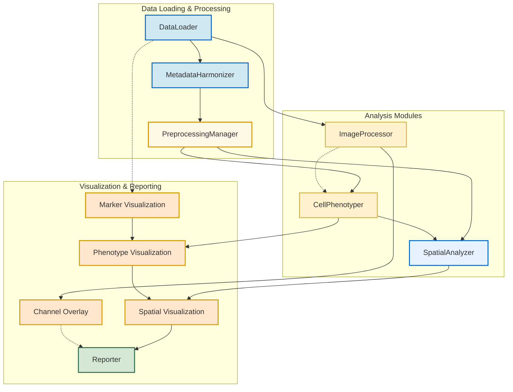

# Steinbock IMC Data Analysis Pipeline

This repository contains an R-based analysis pipeline for Imaging Mass Cytometry (IMC) data, specifically designed to work with outputs from the [Steinbock](https://github.com/BodenmillerGroup/steinbock) preprocessing pipeline. The workflow encompasses data import, annotation, processing, visualization, and advanced analysis of IMC data.

## Pipeline Overview



## Workflow Steps

The pipeline workflow is streamlined into a single entry point (`runIMCWorkflow`), which can be configured to run any combination of the following steps:

1. **load** - Loads and integrates IMC data from Steinbock output
2. **batch_correction** - Performs batch correction on loaded data
3. **phenotyping** - Identifies cell phenotypes through clustering
4. **spatial** - Performs spatial analysis of the tissue
5. **visualize** - Creates visualizations of data and analysis results
6. **report** - Generates a comprehensive analysis report
7. **process_images** - Processes and analyzes image data
8. **channel_overlay** - Creates specialized channel overlay visualizations

## Core Modules

The pipeline is built on a set of unified R6 class modules:

### Data Management

- **ConfigurationManager**: Centralizes all pipeline settings with comprehensive validation
- **DataLoader**: Handles all data import operations from Steinbock output
- **MetadataHarmonizer**: Manages and integrates metadata from various sources
- **DependencyManager**: Manages package dependencies
- **ResultsManager**: Handles storage and export of analysis results

### Analysis Modules

- **PreprocessingManager**: Handles quality control, transformation, and batch correction
- **CellPhenotyper**: Performs cell type identification through clustering algorithms
- **SpatialAnalyzer**: Comprehensive spatial analysis including graphs, communities, and interactions
- **ImageProcessor**: Processes raw image data and performs image-based analysis
- **MarkerAnalyzer**: Performs marker-based analysis, including segmentation-free approaches

### Visualization & Reporting

- **Reporter**: Generates comprehensive analysis reports
- **Visualization System**: Integrated visualization capabilities across various data types

## Configuration System

The pipeline uses a centralized configuration system that allows customization of all workflow aspects.

### Configuration Structure

```R
list(
  # System settings
  system = list(
    n_cores = 4,
    seed = 1234
  ),
  
  # Path configurations
  paths = list(
    data_dir = "data/",
    output_dir = "output/",
    panels = list(
      default = "config/panel.csv"
    )
  ),
  
  # Preprocessing settings
  preprocessing = list(
    quality_control = list(
      min_area = 10,
      max_area = 10000
    ),
    batch_correction = list(
      method = "fastMNN",
      batch_variable = "sample_id",
      num_pcs = 50
    )
  ),
  
  # Phenotyping settings
  phenotyping = list(
    mode = "segmentation",  # or "segmentation_free"
    segmentation = list(
      k_nearest_neighbors = 45,
      use_corrected_embedding = TRUE
    ),
    segmentation_free = list(
      transform_method = "asinh",
      threshold_method = "adaptive",
      k_clusters = 10
    )
  ),
  
  # Spatial analysis settings
  spatial = list(
    graphs = list(
      methods = c("knn", "expansion", "delaunay"),
      knn_k = 10, 
      expansion_threshold = 30
    ),
    communities = list(
      methods = c("graph_based", "celltype_aggregation"),
      min_size = 10
    ),
    interactions = list(
      cell_types_of_interest = c("T cells", "B cells", "Macrophages")
    )
  ),
  
  # Visualization settings
  visualization = list(
    width = 10,
    height = 8,
    dpi = 300,
    max_points = 50000,
    color_scheme = "viridis",
    save_plots = TRUE
  ),
  
  # Processing settings
  processing = list(
    assess_mask_quality = TRUE,
    image_formats = c("tiff", "png")
  )
)
```

## Using the Pipeline

### Prerequisites

- R 4.0.0 or higher
- Bioconductor packages including SpatialExperiment, cytomapper, imcRtools
- Visualization packages: ggplot2, ComplexHeatmap, viridis

### Basic Usage

```R
# Load the main entry point
source("src/entrypoints/IMCWorkflow.R")

# Run the complete workflow with default parameters
results <- runIMCWorkflow(
  config_file = "path/to/my_config.yaml",
  workflow_type = "unsupervised",
  steps = c("load", "batch_correction", "phenotyping", 
            "spatial", "visualize", "report"),
  output_dir = "my_output_dir"
)
```

### Customizing the Workflow

You can customize which steps to run:

```R
# Run only preprocessing and phenotyping steps
results <- runIMCWorkflow(
  config_file = "path/to/my_config.yaml",
  workflow_type = "unsupervised",
  steps = c("load", "batch_correction", "phenotyping"),
  output_dir = "preprocessing_output"
)

# Run only visualization
results <- runIMCWorkflow(
  config_file = "path/to/my_config.yaml",
  workflow_type = "unsupervised",
  steps = c("load", "visualize"),
  output_dir = "visualization_output"
)
```

### Workflow Type Options

- **unsupervised**: Standard analysis workflow with unsupervised phenotyping
- **gated**: Analysis focused on predefined cell populations
- **both**: Runs both unsupervised and gated analysis workflows

### Debugging Mode

The package includes a debugging mode for development and testing:

```R
# After sourcing the IMCWorkflow.R file
debug_workflow(
  workflow_type = "unsupervised",
  steps = c("load", "visualize")
)

# For testing just the channel overlay visualization
debug_channel_overlay()
```

## Output

The pipeline generates:

- Processed SpatialExperiment objects at various stages
- Visualizations of cell phenotypes and marker expression
- Comprehensive analysis reports
- Quality control metrics

All outputs are saved to the configured output directory (default: `output/`).

### Key Output Files

- SpatialExperiment objects for each stage of analysis
- Visualization files (PDF/PNG) for markers, phenotypes, and spatial analysis
- Channel overlay visualizations
- Analysis report summarizing findings

## Troubleshooting

Common issues and their solutions:

1. **Memory errors**: Reduce data size by adjusting max_points in visualization or process fewer samples
2. **Missing channels**: Ensure your panel configuration correctly matches the channel names in your data
3. **Processing errors**: Check the log output for specific error messages
4. **Visualization issues**: Ensure the required visualization packages are installed

For further assistance, please open an issue on the GitHub repository.
