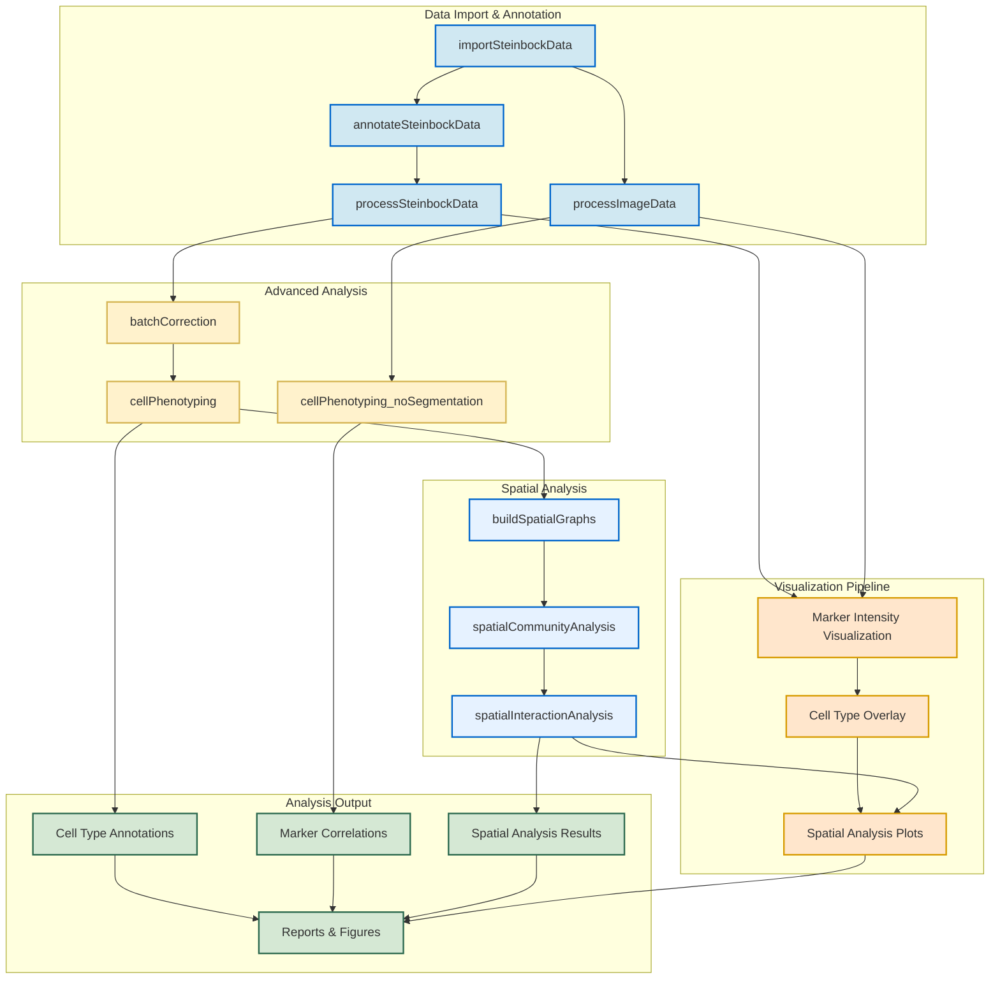

# Steinbock IMC Data Analysis Pipeline

This repository contains an R-based analysis pipeline for Imaging Mass Cytometry (IMC) data, specifically designed to work with outputs from the [Steinbock](https://github.com/BodenmillerGroup/steinbock) preprocessing pipeline. The workflow encompasses data import, annotation, processing, visualization, and advanced analysis of IMC data.

## Pipeline Overview




## Pipeline Components

### Data Import & Annotation

1. **importSteinbockData.R**
   - Imports processed single-cell data from the Steinbock pipeline
   - Loads multi-channel images and segmentation masks
   - Outputs SpatialExperiment object (spe), images, and masks objects

2. **annotateSteinbockData.R**
   - Loads the previously imported SpatialExperiment object
   - Assigns unique cell identifiers
   - Merges external metadata using configuration-driven file paths

3. **processSteinbockData.R**
   - Applies transformations to count data (asinh transformation)
   - Conducts quality control filtering based on cell area
   - Flags channels for downstream analysis
   - Runs dimensionality reduction (PCA, UMAP, t-SNE)

4. **processImageData.R**
   - Loads and processes multi-channel images and segmentation masks
   - Sets channel names from the SpatialExperiment object
   - Attaches masks to images and performs quality control checks

### Advanced Analysis

5. **batchCorrection.R**
   - Performs batch correction using fastMNN method
   - Integrates low-dimensional embeddings for downstream analysis
   - Provides visualizations to assess correction effectiveness

6. **cellPhenotyping.R**
   - Applies clustering algorithms (Rphenoannoy/Rphenograph) to identify cell phenotypes
   - Works with the batch-corrected SpatialExperiment object
   - Creates annotated cells with cluster assignments

7. **cellPhenotyping_noSegmentation.R**
   - Analyzes marker relationships directly from pixel data
   - Provides alternative analysis when cell segmentation may introduce bias
   - Uses multiple analytical techniques while preserving image context

### Spatial Analysis

8. **buildSpatialGraphs.R**
   - Constructs spatial interaction graphs using different methods (kNN, expansion, Delaunay)
   - Creates the foundation for all downstream spatial analyses
   - Outputs SpatialExperiment objects with attached spatial graphs

9. **spatialCommunityAnalysis.R**
   - Detects spatial communities and neighborhoods based on spatial graphs
   - Performs cellular neighborhood aggregation by cell type and expression
   - Supports LISA-based spatial clustering for spatial pattern detection
   - **Dependency**: Requires phenotyped data (`spe_phenotyped.rds`) and will automatically build spatial graphs if needed

10. **spatialInteractionAnalysis.R**
    - Analyzes spatial contexts where distinct neighborhoods interact
    - Detects patches of similar cells and calculates distances to patches
    - Statistically tests cell type interactions and avoidance patterns
    - **Dependency**: Requires community analysis results

### Core Infrastructure

The pipeline is built on a robust infrastructure that includes:

- **ConfigurationManager**: Centralizes all pipeline settings with comprehensive validation
- **Logger**: Provides structured logging across all pipeline components
- **DependencyManager**: Manages package dependencies and environment validation
- **ProgressTracker**: Tracks analysis progress and provides execution summaries
- **ResultsManager**: Handles storage and export of analysis results
- **MetadataHarmonizer**: Merges external metadata into the SpatialExperiment object

### Analysis Modules

The pipeline contains specialized R6 class modules for different analysis tasks:

- **MarkerAnalysis**: Analyzes marker relationships in pixel data
- **SpatialGraph**: Constructs and manages spatial interaction graphs
- **SpatialCommunity**: Detects spatial communities and cellular neighborhoods
- **SpatialInteraction**: Analyzes cell-type interactions and spatial contexts

### Visualization

The `VisualizationFunctions.R` module provides comprehensive visualization capabilities:

- Intensity metric heatmaps
- Channel distribution plots
- Spatial hotspot overlays
- Cell phenotype visualizations
- Comprehensive marker analysis heatmaps

## Configuration System

The pipeline uses a centralized configuration system that allows customization of all aspects of the analysis without modifying code.

### Configuration Structure

Configuration is organized into logical sections:

```R
list(
  # Data paths
  paths = list(...),
  
  # Analysis parameters
  analysis_params = list(...),
  
  # Output settings
  output = list(...),
  
  # Module-specific settings
  batch_correction = list(...),
  phenotyping = list(...),
  marker_analysis = list(...),
  spatial_analysis = list(...),
  community_analysis = list(...)
)
```

### Key Configuration Parameters

#### Data Paths
```R
paths = list(
  # Directory with the steinbock processed single-cell data
  steinbock_data = "data/",
  
  # Directory with multi-channel images
  steinbock_images = "data/img/",
  
  # Directory with segmentation masks
  steinbock_masks = "data/masks/",
  
  # The panel CSV file containing channel metadata
  panel = "data/panel.csv",
  
  # External metadata for sample-level annotation
  metadata_annotation = "data/metadata.csv"
)
```

#### Batch Correction
```R
batch_correction = list(
  # Column in SPE metadata used to identify batches
  batch_variable = "sample_id",
  
  # Random seed for reproducible results
  seed = 220228,
  
  # Number of principal components to use
  num_pcs = 50
)
```

#### Cell Phenotyping
```R
phenotyping = list(
  # Connectivity parameter (higher = more clusters)
  k_nearest_neighbors = 45,
  
  # Random seed for reproducible clustering
  seed = 220619,
  
  # Whether to use batch-corrected embedding for clustering
  use_corrected_embedding = TRUE,
  
  # Whether to use approximate nearest neighbors (faster)
  use_approximate_nn = TRUE,
  
  # Number of CPU cores for parallel processing
  n_cores = 1
)
```

#### Marker Analysis (Without Segmentation)
```R
marker_analysis = list(
  # Input file path for image data
  input_file = NULL,
  
  # Number of pixels to sample (controls memory usage)
  n_pixels = 50000000,
  
  # Whether to transform data
  transformation = TRUE,
  
  # Memory limit in MB (0 = no limit)
  memory_limit = 0,
  
  # Number of CPU cores for parallel processing
  n_cores = 1
)
```

#### Spatial Analysis
```R
spatial_analysis = list(
  # Input file path for spatial graph data
  input_file = "output/spe_phenotyped.rds",
  
  # Methods to use for spatial graph construction
  graph_types = c("expansion", "knn", "delaunay"),
  
  # Distance threshold for expansion-based graphs (in pixels)
  expansion_threshold = 30,
  
  # Number of neighbors for kNN graphs
  knn_k = 10
),

community_analysis = list(
  # Input file path for community analysis
  input_file = "output/spe_spatial_graphs.rds",
  
  # Whether to require spatial graphs (will build them if missing)
  require_spatial_graphs = TRUE,
  
  # Methods to use for community detection
  methods = c("graph_based", "celltype_aggregation", "expression_aggregation", "lisa"),
  
  # Column to use for compartment assignments
  compartment_column = "celltype",
  
  # Which phenotyping result column to use for cell types
  phenotyping_column = "phenograph_corrected",
  
  # Whether to use direct cell type analysis instead of compartments
  direct_celltype_analysis = TRUE,
  
  # Marker definitions for cell type classification
  marker_definitions = list(
    "immune_markers" = c("CD45", "Ly6G", "CD11b"),
    "structural_markers" = c("CD140a", "CD140b"),
    "endothelial_markers" = c("CD31", "CD34"),
    "macrophage_markers" = c("CD206"),
    "injury_markers" = c("CD44")
  ),
  
  # Minimum size of communities to keep
  size_threshold = 10,
  
  # Method for cellular neighborhood analysis
  cn_method = "knn",
  
  # Number of neighbors for cellular neighborhood analysis
  cn_k = 20,
  
  # Radii for LISA curve calculation (in pixels)
  lisa_radii = c(10, 20, 50),
  
  # Number of clusters for k-means in neighborhood analysis
  n_clusters = 6,
  
  # Number of CPU cores for parallel processing
  n_cores = 1
)
```

### Using Custom Configuration

There are several ways to customize the pipeline configuration:

#### 1. Direct Modification After Initialization

```R
# Create configuration manager with defaults
configManager <- ConfigurationManager$new()

# Modify specific parameters
configManager$config$paths$steinbock_data <- "path/to/my/data"
configManager$config$phenotyping$k_nearest_neighbors <- 30
configManager$config$batch_correction$batch_variable <- "patient_id"

# Validate the modified configuration
configManager$validate_config(configManager$config)
```

#### 2. Using merge_with_defaults Method

```R
# Create custom configuration
my_config <- list(
  paths = list(
    steinbock_data = "path/to/my/data",
    panel = "path/to/my/panel.csv"
  ),
  phenotyping = list(
    k_nearest_neighbors = 30
  ),
  batch_correction = list(
    batch_variable = "patient_id"
  )
)

# Create configuration manager and merge with defaults
configManager <- ConfigurationManager$new()
configManager$merge_with_defaults(my_config)
```

## Getting Started

### Prerequisites

- R 4.0.0 or higher
- Bioconductor packages including SpatialExperiment, cytomapper, imcRtools
- Visualization packages: ggplot2, ComplexHeatmap, viridis

### Setup and Execution

1. **Clone this repository**:
   ```bash
   git clone https://github.com/yourusername/imc-analysis-pipeline.git
   cd imc-analysis-pipeline
   ```

2. **Prepare your data directories**:
   - Place your Steinbock outputs in the data directory (or configure custom paths)
   - Ensure you have a panel.csv file with channel metadata

3. **Create a custom configuration (optional)**:
   Create a file called `my_config.R` with your customizations:
   ```R
   my_config <- list(
     paths = list(
       steinbock_data = "path/to/steinbock/data",
       panel = "path/to/panel.csv"
     ),
     batch_correction = list(
       batch_variable = "patient_id"
     )
   )
   ```

4. **Run the pipeline**:
   ```R
   # Launch R from the project root directory
   setwd("/path/to/imc-analysis-pipeline")
   
   # Load custom configuration (if created)
   source("my_config.R")
   
   # Set up configuration
   source("src/core/ConfigurationManager.R")
   configManager <- ConfigurationManager$new()
   if (exists("my_config")) {
     configManager$merge_with_defaults(my_config)
   }
   
   # Import data
   source("src/entrypoints/importSteinbockData.R")
   data_objects <- runImportSteinbockData()
   
   # Continue with additional entrypoints as needed
   source("src/entrypoints/annotateSteinbockData.R")
   spe_annotated <- runAnnotateSteinbockData()
   
   source("src/entrypoints/processSteinbockData.R")
   spe_processed <- runProcessSteinbockData()
   
   source("src/entrypoints/batchCorrection.R")
   spe_corrected <- runBatchCorrection()
   
   source("src/entrypoints/cellPhenotyping.R")
   spe_phenotyped <- runCellPhenotyping()
   
   # Spatial analysis workflow
   source("src/entrypoints/buildSpatialGraphs.R")
   spe_spatial <- runBuildSpatialGraphs()
   
   source("src/entrypoints/spatialCommunityAnalysis.R")
   spe_communities <- runSpatialCommunityAnalysis()
   
   source("src/entrypoints/spatialInteractionAnalysis.R")
   spe_interactions <- runSpatialInteractionAnalysis()
   ```

### Workflow Dependencies

The pipeline components have specific dependencies that are automatically managed:

1. **Data Import → Processing → Phenotyping**: This is the core workflow for cell type identification.
2. **Phenotyping → Spatial Analysis**: Cell phenotyping must be completed before spatial analysis.
3. **Spatial Graphs → Community Analysis → Interaction Analysis**: This is the spatial analysis workflow.

The `spatialCommunityAnalysis.R` script now includes automatic dependency resolution:
- It requires phenotyped data (`spe_phenotyped.rds`)
- It will automatically build spatial graphs if they don't exist
- It checks for required columns and creates them if possible

### Advanced Usage

#### Running Segmentation-Free Analysis

For datasets where cell segmentation may be problematic:

```R
source("src/entrypoints/cellPhenotyping_noSegmentation.R")
analyzer <- runMarkerAnalysisNoSegmentation()
```

This creates comprehensive marker relationship analyses and visualizations using pixel data directly, bypassing potentially problematic cell segmentation.

#### Adjusting Clustering Parameters

To customize the cell phenotyping process:

```R
configManager$config$phenotyping$k_nearest_neighbors <- 30  # For fewer, larger clusters
configManager$config$phenotyping$n_cores <- 4               # For parallel processing
source("src/entrypoints/cellPhenotyping.R")
spe_phenotyped <- runCellPhenotyping()
```

#### Customizing Immune Cell Analysis

For kidney injury or other specialized datasets:

```R
# Update immune cell patterns for kidney-specific analysis
configManager$config$community_analysis$immune_cell_patterns <- c(
  "macrophage", "T cell", "B cell", "neutrophil", "leukocyte"
)

# Update marker definitions for your specific panel
configManager$config$community_analysis$marker_definitions <- list(
  "immune_markers" = c("CD45", "CD3", "CD20"),
  "structural_markers" = c("SMA", "Collagen"),
  "tubular_markers" = c("AQP1", "AQP2", "LTL"),
  "injury_markers" = c("KIM1", "NGAL")
)

# Run spatial community analysis with custom settings
source("src/entrypoints/spatialCommunityAnalysis.R")
spe_communities <- runSpatialCommunityAnalysis()
```

## Output

The pipeline generates:

- Processed SpatialExperiment objects at various stages
- Visualizations of cell phenotypes and marker expression
- Comprehensive analysis reports
- Quality control metrics

All outputs are saved to the configured output directory (default: `output/`).

### Key Output Files

- `spe.rds`: Initial SpatialExperiment object
- `spe_annotated.rds`: Annotated with external metadata
- `spe_processed.rds`: After QC and transformation
- `spe_batch_corrected.rds`: After batch correction
- `spe_phenotyped.rds`: With cluster assignments
- `spe_spatial_graphs.rds`: With spatial interaction graphs
- `spe_communities.rds`: With community and neighborhood annotations
- `spe_interactions.rds`: With spatial interaction statistics
- `images_processed.rds`: Processed image data
- `marker_analysis_results.rds`: Results from segmentation-free analysis
- `immune_infiltration_results.rds`: Results from immune infiltration analysis
- Various plots and visualizations in PNG/PDF format

## Troubleshooting

Common issues and their solutions:

1. **Memory errors**: Reduce `n_pixels` in segmentation-free analysis or process fewer samples at a time
2. **Missing channels**: Ensure your panel.csv correctly matches the channel names in your data
3. **Missing spatial graphs**: If you encounter errors about missing spatial graphs, ensure you've run `buildSpatialGraphs.R` or set `require_spatial_graphs = TRUE` in the configuration
4. **Cell type errors**: If cell types are not properly detected, check that the `phenotyping_column` parameter points to the correct column in your data

For further assistance, please open an issue on the GitHub repository.
